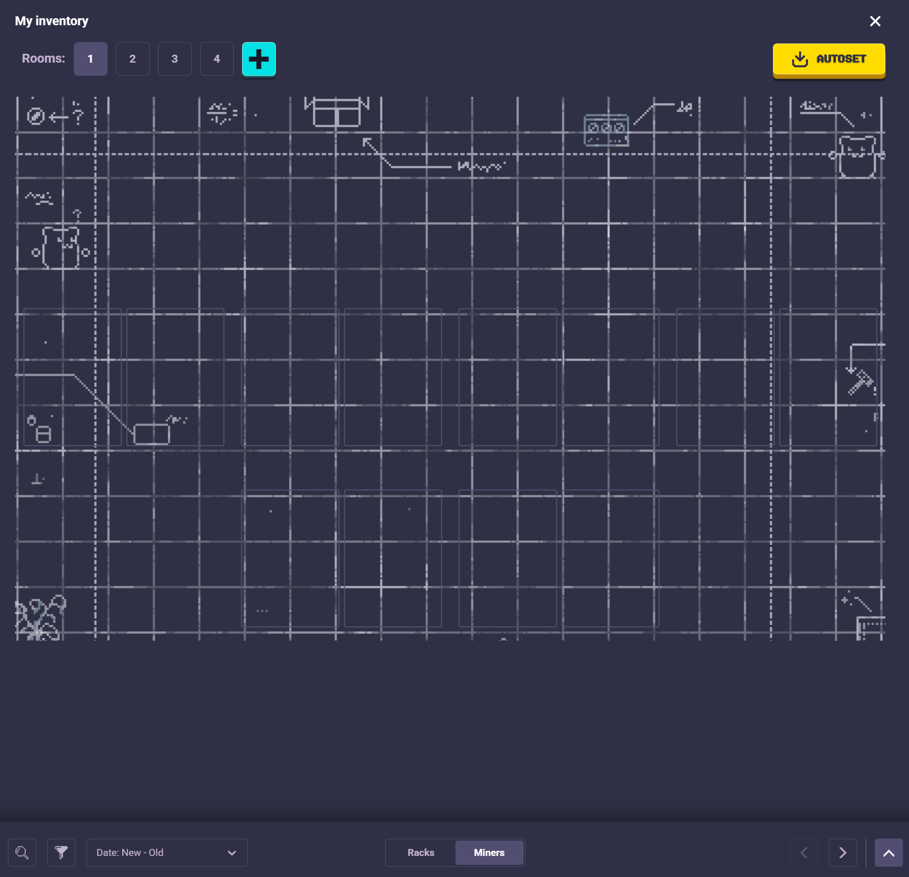

# RollerCoin Room Builder

Scrapes your [RollerCoin](https://rollercoin.com/?r=kyaf3h0b) rooms from saved HTML pages, visualises every rack, and runs a greedy optimizer to suggest the best miner swaps — no screenshots, no OCR, no detectable interaction with the game.

| Script | Purpose |
|---|---|
| `app/main.py` | **Start here.** Runs the full 12-phase pipeline in one command. |
| `app/parse_room.py` | Parses room HTML pages into structured rack JSON. |
| `app/scrape_miners.py` | Fetches miner data and images from [minaryganar.com](https://minaryganar.com). |
| `app/visualize_room.py` | Renders rack JSON into PNG images. |
| `app/optimizer.py` | Greedy optimizer — finds the best inventory swaps to maximise power. |
| `app/vis_swaps.py` | Renders the swap plan as an annotated room image. |
| `app/select_locked.py` | Interactive UI to mark placed miners as locked (won't be swapped). |
| `app/verify_matches.py` | UI to confirm or reject auto-matched miner names. |
| `app/refetch_missing.py` | Re-fetches miners whose power/bonus data is missing. |
| `app/reset.py` | Deletes all generated data and returns the project to a clean state. |

## Setup
Clone this repository (HTTPS):

```bash
git clone https://github.com/Dorfistain1/Rollercoin-Room-Optimizer.git
cd Rollercoin-Room-Optimizer
```

Or clone with SSH (if you have SSH keys set up):

```bash
git clone git@github.com:Dorfistain1/Rollercoin-Room-Optimizer.git
cd Rollercoin-Room-Optimizer
```

Download as ZIP from GitHub (via browser): open the repo page and choose **Code → Download ZIP**, or via command line:

```bash
curl -L -o repo.zip https://github.com/Dorfistain1/Rollercoin-Room-Optimizer/archive/refs/heads/main.zip
unzip repo.zip
```

After cloning/opening the folder, install dependencies:

```bash
pip install -r requirements.txt
```


## Quick start

### 1 — Save your room pages from the browser

1. Open your RollerCoin room in edit view in Chrome. (The page that looks like this: )
2. Press `Ctrl+S` (or `Cmd+S` on Mac) to save the page as HTML. Save the file directly into the `html_page/` folder.
3. Repeat for each room.

> Filenames don't matter — rooms are numbered in alphabetical order of filename.

### 1b — Save your inventory pages

1. Open your RollerCoin room in edit view in a browser and open the inventory (miners) tab.

2. Sort by `Power` or `Bonus` (High to Low).
3. Press `Ctrl+S` (or `Cmd+S` on Mac) to save the inventory page into `html_page/`.
4. Scroll right until the loading icon appears, then save again to capture the next chunk. Repeat as needed.
5. Repeat for the other sort order if you want both views (recommended).

> Saving the first two pages per sort order is usually enough.

**How the pipeline detects inventory pages:** if your rooms are all unique it figures it out automatically. If you have pages that might be ambiguous (very unlikely), name inventory files with a `power` or `bonus` prefix (e.g. `power1.html`, `bonus.html`) to force the classification.

### 2 — Run

```bash
python app/main.py
```

The pipeline runs automatically:

| Phase | What happens |
|---|---|
| 1 | Classifies each `.html` in `html_page/` as room or inventory |
| 2 | Parses room pages → `data/placed_room*.json` |
| 3 | Downloads missing room miner images + stats |
| 4 | Re-parses rooms with fresh data for accurate names |
| 5–7 | Merges inventory pages, downloads missing inventory miners, saves `data/inventory.json` |
| 8 | Renders each room → `vis/room*.png` |
| 9 | Opens verification UI for any unconfirmed miner name matches |
| 10 | Opens UI to lock miners you don't want swapped (usually for set bonuses) |
| 11 | Runs the optimizer, prints the swap plan, saves `data/optimizer_swaps.json` |
| 12 | Renders swap plan → `output/swaps_room*.png` |
| 13 | Cleans up `_files/` folders left by the browser in `html_page/` |

Final swap visualizations are written to `output/swaps_room*.png` (one file per room). Open the `output/` folder to view the rendered swap plans after the pipeline completes.

---

## Output

| Path | Description |
|---|---|
| `data/placed_room*.json` | Rack-grouped miner data per room |
| `data/inventory.json` | Merged inventory sorted by power |
| `data/optimizer_swaps.json` | Swap plan produced by the optimizer |
| `data/locked.json` | List of locked miner positions |
| `data/match_log.json` | Verified miner name mappings |
| `vis/room*.png` | Rendered room visualizations |
| `output/swaps_room*.png` | Swap plan visualizations |
| `miners/<Name>.<ext>` | Downloaded miner images |
| `miners/miners_data.json` | Miner stats (power / bonus per rarity) |

### Room visualization

Each column is one rack. Miners are stacked top-to-bottom, racks left-to-right in game order. Rarity badges appear top-left of each miner cell; power and bonus stats are shown below the image.

### Swap visualization

Each swap is outlined in a unique colour with a numbered badge. The legend strip below the room shows the miner(s) being removed → the miner(s) being added, alongside the effective-power gain. Swaps that change slot size (2-cell ↔ pair) show a **place PAIR** or **place 2-CELL** hint.

### Optimizer — set bonus

After showing the current state the optimizer asks for the actual total bonus % shown in-game. Enter it once and the offset is saved to `data/set_bonus.json` and reused on every subsequent run.

---

## Resetting for a new run

When you want to start fresh with new room saves, run the reset script to wipe all generated data:

```bash
python app/reset.py
```

This deletes:
- `data/*.json` — parsed rooms, inventory, swap plan, lock list, match log, set-bonus offset
- `vis/*.png` — room visualizations
- `output/*.png` — swap visualizations
- `html_page/*.html` — saved game pages
- `miners/` — all downloaded miner images and `miners_data.json`

**If your rooms haven't changed much** (most of the same miners are still there), use the `--keep-miners` flag to skip re-downloading images and stats:

```bash
python app/reset.py --keep-miners
```

After resetting, drop your new `.html` pages into `html_page/` and run `python app/main.py` as normal.

---

### placed_room*.json structure

```json
{
  "source_file": "Room1.html",
  "parsed_at": "2026-04-12T10:00:00+00:00",
  "total_placed": 49,
  "racks": [
    [
      { "name": "Energy Amplifier", "slug": "energy_amplifier", "rarity": "common", "slot_size": 2 },
      { "name": "Valhalla's Vault",  "slug": "valhallas_vault",  "rarity": "rare",   "slot_size": 2 }
    ],
    [ ... ]
  ]
}
```

- `racks` — list of racks; each rack is a list of miners in top-to-bottom order.
- `rarity` — read from the in-game badge (`common` / `uncommon` / `rare` / `epic` / `legendary` / `unreal`).
- `slot_size` — cells the miner occupies (1 or 2).

---

## Running scripts individually

All scripts live in `app/` and are run from the `root/` directory.

### parse_room.py

```bash
python app/parse_room.py
python app/parse_room.py html_page/MyRoom.html   # specific file
```

### visualize_room.py

```bash
python app/visualize_room.py
```

### scrape_miners.py

```bash
python app/scrape_miners.py "Antminer S19"   # fetch / refresh one miner
python app/scrape_miners.py                  # full scrape (slow)
```

### optimizer.py

```bash
python app/optimizer.py
python app/optimizer.py --dry-run   # print plan without saving
```

### vis_swaps.py

```bash
python app/vis_swaps.py        # all rooms
python app/vis_swaps.py 2      # room 2 only
```

### select_locked.py

```bash
python app/select_locked.py
```

---

## Notes

- **Missing miner images** — renders as a gray placeholder. Retry with `python app/scrape_miners.py "Miner Name"`.
- **Scraper rate limiting** — waits 2 s between pages, retries up to 4 times with exponential back-off.
- **Multiple rooms** — one `.html` per room in `html_page/`. Processed in alphabetical order so the default browser save names (`… Game.html`, `… Game 2.html`, …) map to room 1, room 2, … correctly.

## Known limitations

- Rack bonuses are not taken into account.